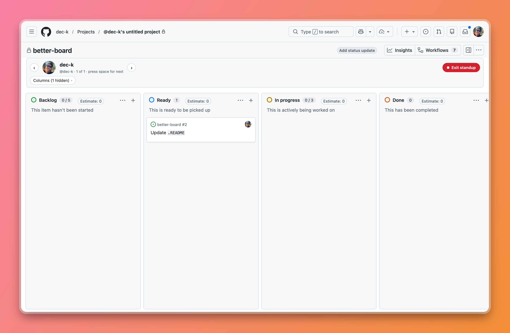

# better-board

**better-board** is a browser extension aimed at making Github Project Boards simpler to navigate for people in a rush. It is a lightweight DOM injector that adds in custom assignee and column filters that are more readily surfaced. It also supports a minimal _Standup Mode_ to quickly tab through people on large projects.

Absolutely no external API calls are made, no data leaves your browser. This only reads DOM data that GitHub already has - and reframes it for convenience.



## Install

**Currently, the plugin is not publically published, and must be installed as a loose/debug addon in your respective browser.**

**Chrome / Edge**

1. Open `chrome://extensions`.
2. Enable **Developer mode**.
3. Choose **Load unpacked** and select this directory.

**Firefox** (140+; the manifest asks for 142+)

1. Open `about:debugging#/runtime/this-firefox`.
2. Choose **Load Temporary Add-on** and select `manifest.json`.

Or, with [`web-ext`](https://github.com/mozilla/web-ext) installed:

```
npx web-ext run
```

Open any GitHub Projects board view and the bar appears below the filter input. Toggle the whole
thing off from the extension's popup.

## Notes

Selections are remembered per project. Hidden columns persist across reloads; the assignee
selection is reflected in the filter query, so it also survives sharing the URL.

The team list is built from the assignees on the board's items — it grows as more items load and
never shrinks while you filter, so you can always click your way back to someone.

Counts come from the item data GitHub embeds in the page, which only covers the first page of
each column. On a board large enough to page, the counts are floors and are shown as `N+`;
someone discovered from a card avatar rather than that payload gets no number at all rather than
a wrong one.

Sub-issue nesting reorders cards with flex `order` and never moves a DOM node, so GitHub's
drag-and-drop and its own rendering are left alone. Only children sharing a column with their
parent are nested — pulling a card into a column it isn't in would misstate its status — and
because the reorder is visual, keyboard and screen-reader order follow the original DOM.

## Layout

| File | Purpose |
| --- | --- |
| `manifest.json` | MV3 manifest, content script registration |
| `content.js` | Reads board data, renders the bar, drives the filter and column visibility |
| `content.css` | Styles for the bar, themed off GitHub's own CSS variables |
| `popup.html` / `popup.js` | On/off switch |

`content.js` matches GitHub's hashed CSS-module class names by module prefix (the trailing hash
changes between GitHub deploys, the prefix does not). If GitHub renames a module, the selectors
in `SEL` at the top of the file are the only thing to update.

Both browsers run the same code. Firefox exposes the promise-based extension APIs as `browser`
and Chrome as `chrome`, so `content.js` and `popup.js` each pick whichever exists. There is no
build step and no polyfill dependency.

`npx web-ext lint` should stay clean — it is the only check this repo has.
